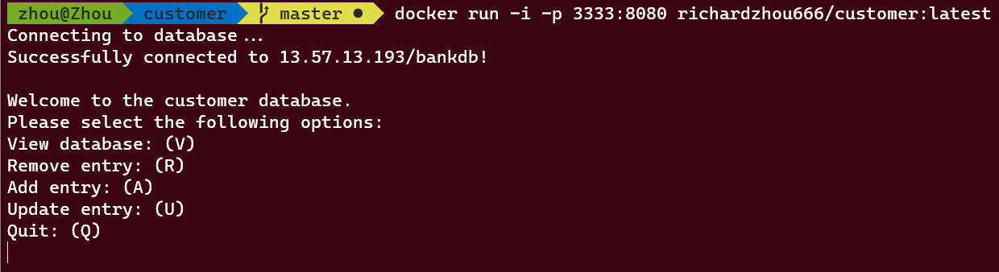

# Interactive Customer Database Mini-Project
## Author: Richard Zhou  



This is a simple Dev-Ops mini project that creates a customer database in MySQL server and deployed to AWS in docker container. The application is written in Java, built by Maven which allows user to view and query the database on command line. The database is populated using some dummy data. The application is packaged as an executable `.jar` file in the `./out/` directory. To have access to the User Interface locally, clone the repository and run the following command in terminal: 

```
$ cd out/artifacts/customer_jar
$ java -jar customer.jar
```

Here are the links to the DockerHub repositories that are used in this project:  
* https://hub.docker.com/repository/docker/richardzhou666/mysql-bank (database)
* https://hub.docker.com/repository/docker/richardzhou666/customer (UI)

To run the application from the Docker container, make sure you have Docker installed and run the following command in terminal:

```
$ docker run -i -p 3333:8080 richardzhou666/customer:latest
```

#### Update
Added `docker-compose.yml` file. This compose file will create two containers with a single command. Use the following code to get access to the interactive UI:

```
$ docker-compose run jar
```

Notice, the following command will **not work interactively**:

```
$ docker-compose up
```

#### Note
The database is up and running on my AWS EC2 instance. If you want to connect to your local database after running the MySQL container, simply change the URL to your local public IP in `./customer/src/main/java/ReadDatabase.java`.

Tools used in this mini-project:
* Java
* Maven
* Docker
* MySQL
* AWS 